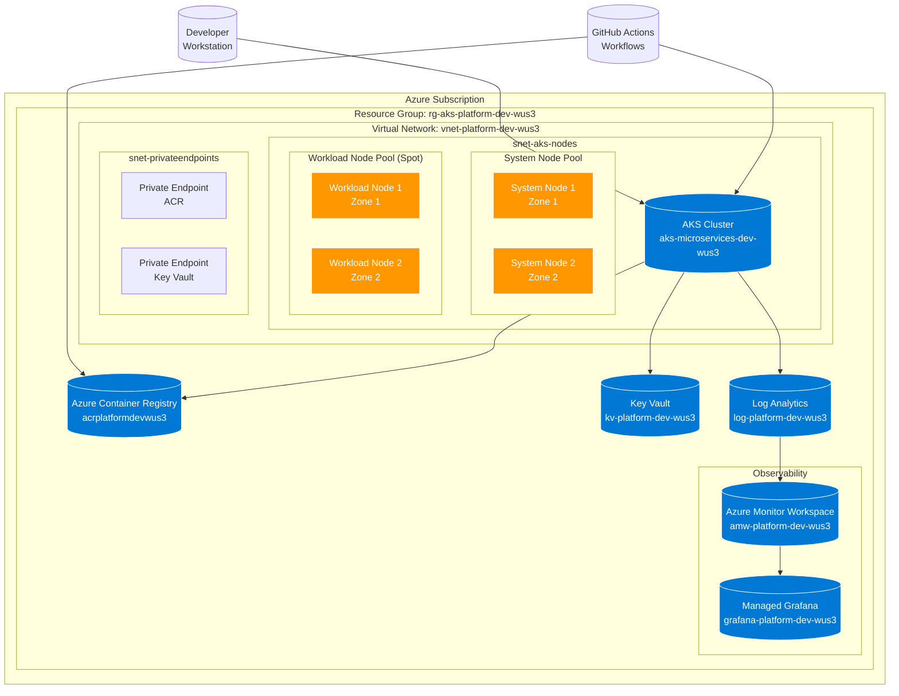
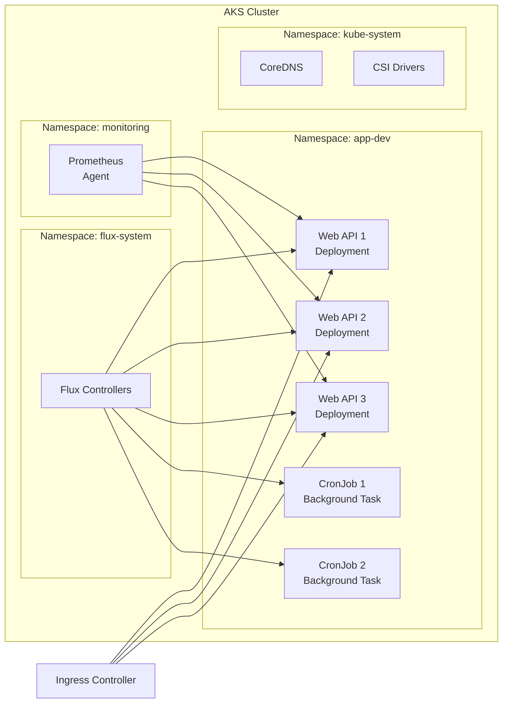
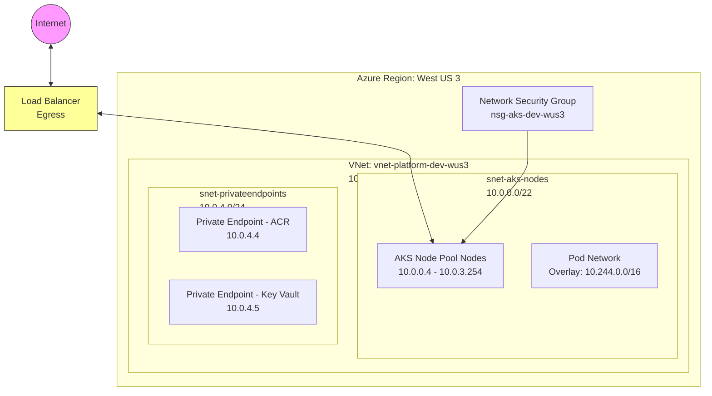
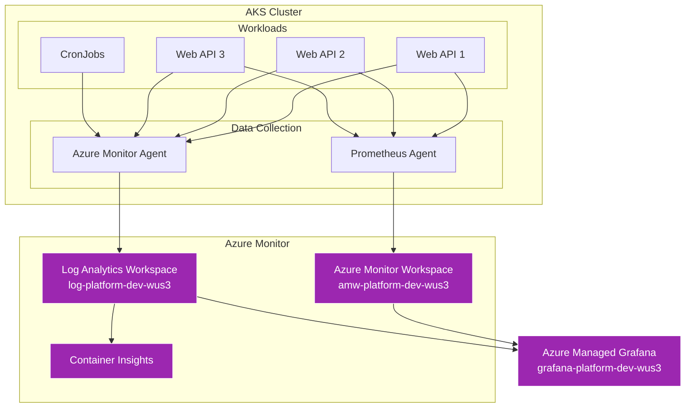
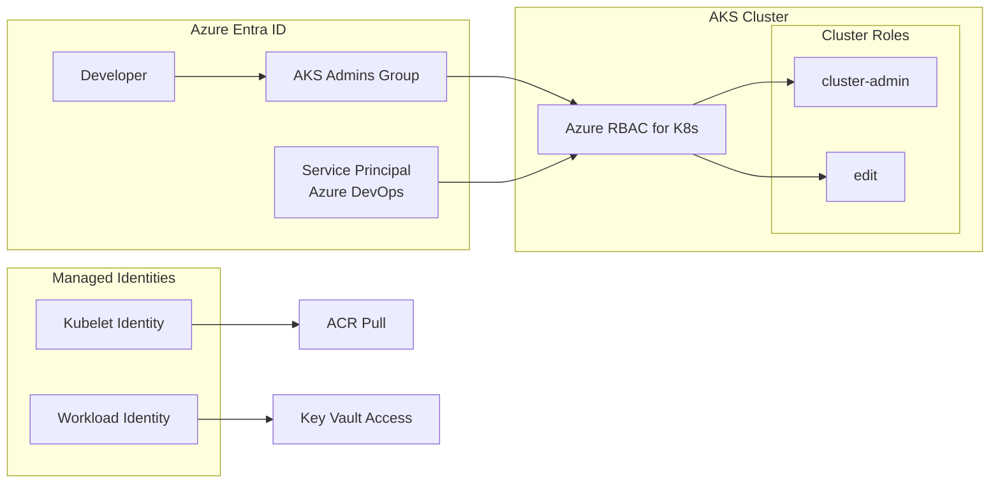
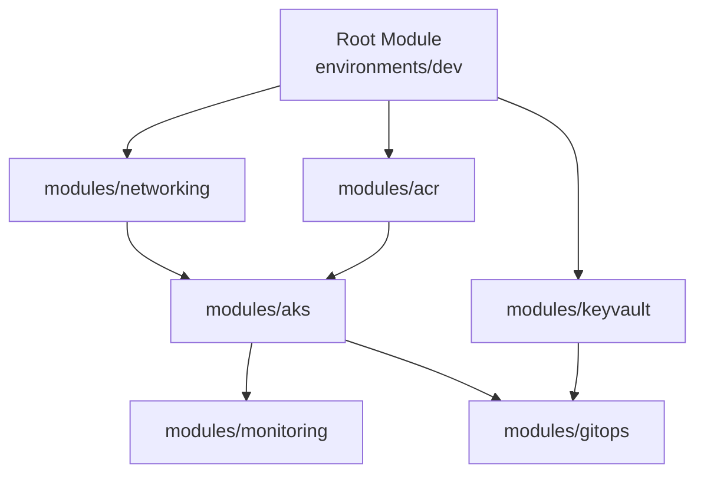
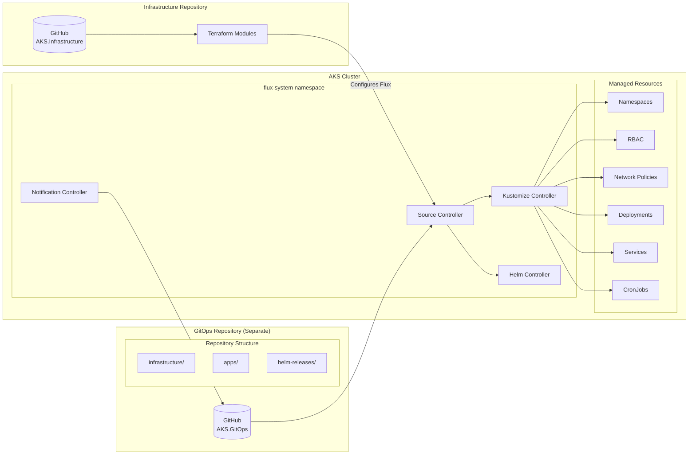
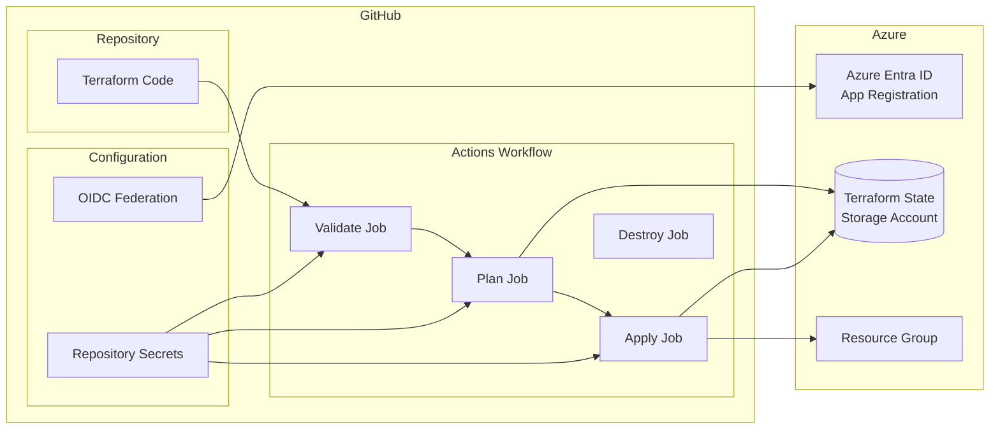
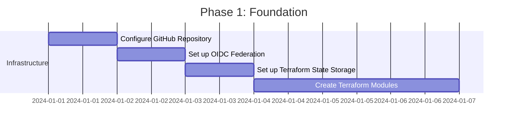

# AKS Microservices Platform - Architecture Design Document

## Document Information

| Attribute | Value |
|-----------|-------|
| **Version** | 1.0 |
| **Last Updated** | December 2024 |
| **Author** | Platform Team |
| **Status** | Draft |
| **Environment** | Development |

---

## Table of Contents

1. [Executive Summary](#1-executive-summary)
2. [Architecture Overview](#2-architecture-overview)
3. [Network Architecture](#3-network-architecture)
4. [AKS Cluster Configuration](#4-aks-cluster-configuration)
5. [Azure Container Registry](#5-azure-container-registry)
6. [Observability Design](#6-observability-design)
7. [Security Design](#7-security-design)
8. [Terraform Project Structure](#8-terraform-project-structure)
9. [GitOps Configuration (Flux v2)](#9-gitops-configuration-flux-v2)
10. [GitHub Actions CI/CD Configuration](#10-github-actions-cicd-configuration)
11. [Resource Naming Conventions](#11-resource-naming-conventions)
12. [Cost Estimation](#12-cost-estimation)
13. [Implementation Roadmap](#13-implementation-roadmap)
14. [References](#14-references)

---

## 1. Executive Summary

### 1.1 Project Overview

This document outlines the architecture design for a Terraform Infrastructure as Code (IaC) project to deploy an Azure Kubernetes Service (AKS) cluster optimized for microservices development. The solution is designed for a small development team (1-2 developers) working on containerized applications in a single Azure region.

### 1.2 Goals and Objectives

| Goal | Description |
|------|-------------|
| **Developer Productivity** | Provide a fully functional Kubernetes environment for rapid development and testing |
| **Cost Optimization** | Minimize infrastructure costs while maintaining essential capabilities |
| **Security by Default** | Implement foundational security controls appropriate for development |
| **Full Observability** | Enable comprehensive monitoring, logging, and metrics collection |
| **GitOps Ready** | Automated deployments via Flux v2 for consistent, declarative configuration |
| **Infrastructure as Code** | All infrastructure managed through Terraform with GitHub Actions CI/CD |

### 1.3 Scope

| In Scope | Out of Scope |
|----------|--------------|
| Single AKS cluster in West US 3 | Multi-region deployment |
| 3 small microservices (Web APIs + CronJobs) | High-availability production configuration |
| Azure Container Registry (Basic) | Premium ACR features (geo-replication) |
| Full observability stack | Advanced APM solutions |
| Flux v2 GitOps | ArgoCD or other GitOps tools |
| GitHub Actions CI/CD | Azure DevOps pipelines |
| Development environment | Staging/Production environments |

### 1.4 Key Design Decisions

| Decision | Rationale |
|----------|-----------|
| Public AKS cluster | Simplifies development access; secured via Azure RBAC |
| Burstable VM SKUs (B2ms) | Cost-effective for variable dev workloads |
| Spot instances for workloads | 60-90% cost savings on non-critical dev workloads |
| No NAT Gateway | Load balancer egress sufficient for dev |
| No DDoS Protection | Not required for development environment |
| Azure CNI Overlay | Better IP management, sufficient for dev scale |

---

## 2. Architecture Overview

### 2.1 High-Level Architecture



### 2.2 Component Summary

| Component | Purpose | SKU/Tier |
|-----------|---------|----------|
| AKS Cluster | Container orchestration platform | Free tier (control plane) |
| System Node Pool | Kubernetes system components | 2x Standard_B2ms |
| Workload Node Pool | Application workloads | 2x Standard_B2ms (Spot) |
| Azure Container Registry | Container image storage | Basic |
| Azure Key Vault | Secrets management | Standard |
| Log Analytics Workspace | Log aggregation | Pay-as-you-go |
| Azure Monitor Workspace | Prometheus metrics | Pay-as-you-go |
| Azure Managed Grafana | Metrics visualization | Essential |

### 2.3 Workload Architecture



---

## 3. Network Architecture

### 3.1 Network Topology



### 3.2 IP Address Allocation

| Subnet | CIDR | Available IPs | Purpose |
|--------|------|---------------|---------|
| snet-aks-nodes | 10.0.0.0/22 | 1,019 | AKS node pool nodes |
| snet-privateendpoints | 10.0.4.0/24 | 251 | Private endpoints for PaaS services |
| **Pod Network (Overlay)** | 10.244.0.0/16 | 65,536 | Kubernetes pod IPs |
| **Service Network** | 10.245.0.0/16 | 65,536 | Kubernetes service IPs |

### 3.3 Network Security

| Rule | Direction | Priority | Source | Destination | Port | Action |
|------|-----------|----------|--------|-------------|------|--------|
| AllowHTTPS | Inbound | 100 | Internet | AKS Subnet | 443 | Allow |
| AllowHTTP | Inbound | 110 | Internet | AKS Subnet | 80 | Allow |
| DenyAllInbound | Inbound | 4096 | Any | Any | Any | Deny |

### 3.4 DNS Configuration

| Zone | Purpose |
|------|---------|
| privatelink.azurecr.io | ACR private endpoint resolution |
| privatelink.vaultcore.azure.net | Key Vault private endpoint resolution |

---

## 4. AKS Cluster Configuration

### 4.1 Cluster Specifications

| Setting | Value | Rationale |
|---------|-------|-----------|
| Cluster Name | aks-microservices-dev-wus3 | Standard naming convention |
| Kubernetes Version | 1.30.x (latest stable) | Latest features and security patches |
| SKU Tier | Free | Sufficient for dev; no SLA required |
| Private Cluster | No | Simplified access for development |
| Network Plugin | Azure CNI Overlay | Efficient IP usage, simpler management |
| Network Policy | Azure | Native Kubernetes network policies |
| DNS Prefix | aks-microservices-dev | Unique DNS name |
| Availability Zones | 1, 2, 3 | High availability within region |

### 4.2 Node Pool Configuration

#### System Node Pool

| Setting | Value |
|---------|-------|
| Name | system |
| Mode | System |
| VM SKU | Standard_B2ms |
| OS Type | Linux |
| OS Disk Type | Ephemeral |
| Node Count | 2 (min: 2, max: 3) |
| Availability Zones | 1, 2, 3 |
| Max Pods per Node | 30 |
| Node Labels | `nodepool=system` |
| Node Taints | `CriticalAddonsOnly=true:NoSchedule` |
| Autoscaling | Enabled |

#### Workload Node Pool

| Setting | Value |
|---------|-------|
| Name | workload |
| Mode | User |
| VM SKU | Standard_B2ms |
| OS Type | Linux |
| OS Disk Type | Ephemeral |
| Priority | Spot |
| Eviction Policy | Delete |
| Spot Max Price | -1 (market price) |
| Node Count | 2 (min: 1, max: 4) |
| Availability Zones | 1, 2, 3 |
| Max Pods per Node | 30 |
| Node Labels | `nodepool=workload`, `kubernetes.azure.com/scalesetpriority=spot` |
| Node Taints | `kubernetes.azure.com/scalesetpriority=spot:NoSchedule` |
| Autoscaling | Enabled |

### 4.3 VM SKU Specifications

| SKU | vCPUs | Memory | Temp Storage | Category |
|-----|-------|--------|--------------|----------|
| Standard_B2ms | 2 | 8 GB | 16 GB | Burstable |

> **Note**: B-series VMs are cost-effective for development workloads with variable CPU usage. They accumulate credits during low-usage periods that can be consumed during bursts.

### 4.4 Cluster Add-ons and Features

| Feature | Status | Purpose |
|---------|--------|---------|
| Azure Monitor (Container Insights) | Enabled | Log collection and monitoring |
| Azure Policy | Enabled | Governance and compliance |
| Azure Key Vault Provider for Secrets Store CSI Driver | Enabled | Secret injection into pods |
| OIDC Issuer | Enabled | Workload Identity federation |
| Workload Identity | Enabled | Pod-level managed identities |
| Vertical Pod Autoscaler | Disabled | Not required for dev |
| HTTP Application Routing | Disabled | Using Flux-deployed ingress |

### 4.5 Maintenance Configuration

| Setting | Value |
|---------|-------|
| Auto-upgrade Channel | stable |
| Node OS Upgrade Channel | NodeImage |
| Maintenance Window | Weekends, 02:00-06:00 UTC |

---

## 5. Azure Container Registry

### 5.1 Configuration

| Setting | Value |
|---------|-------|
| Name | acrplatformdevwus3 |
| SKU | Basic |
| Admin User | Disabled |
| Public Network Access | Enabled (with firewall rules) |
| Zone Redundancy | Disabled (Basic SKU) |

### 5.2 AKS Integration

| Setting | Value |
|---------|-------|
| Authentication | Managed Identity (AcrPull role) |
| Private Endpoint | Optional for dev |

### 5.3 Image Management

| Policy | Value |
|--------|-------|
| Retention Policy | 7 days for untagged manifests |
| Content Trust | Disabled (dev environment) |
| Quarantine | Disabled (dev environment) |

---

## 6. Observability Design

### 6.1 Observability Architecture



### 6.2 Azure Monitor Container Insights

| Setting | Value |
|---------|-------|
| Log Analytics Workspace | log-platform-dev-wus3 |
| Data Collection Interval | 60 seconds |
| Namespace Filtering | All namespaces |
| Retention Period | 30 days |
| Collected Data | Stdout/stderr logs, metrics, inventory |

### 6.3 Azure Managed Prometheus

| Setting | Value |
|---------|-------|
| Azure Monitor Workspace | amw-platform-dev-wus3 |
| Data Collection Rule | Enabled |
| Scrape Interval | 30 seconds |
| Retention Period | 30 days |

#### Default Scrape Targets

| Target | Enabled |
|--------|---------|
| kubelet | Yes |
| cAdvisor | Yes |
| Node | Yes |
| CoreDNS | Yes |
| Kube-state-metrics | Yes |
| Custom pod annotations | Yes |

### 6.4 Azure Managed Grafana

| Setting | Value |
|---------|-------|
| Instance Name | grafana-platform-dev-wus3 |
| SKU | Essential |
| Zone Redundancy | Disabled |
| API Key Creation | Enabled |
| Deterministic Outbound IP | Disabled |

#### Pre-configured Dashboards

| Dashboard | Source |
|-----------|--------|
| Kubernetes / Cluster Overview | Built-in |
| Kubernetes / Namespace Resources | Built-in |
| Kubernetes / Pod Resources | Built-in |
| Node Exporter Full | Community |
| Flux GitOps | Community |

### 6.5 Alerting Strategy

| Alert | Severity | Condition |
|-------|----------|-----------|
| High Pod CPU | Warning | CPU > 80% for 10 min |
| High Pod Memory | Warning | Memory > 85% for 10 min |
| Pod Restart Loop | Critical | Restarts > 5 in 10 min |
| Node Not Ready | Critical | Node NotReady > 5 min |
| Persistent Volume Full | Warning | PV usage > 85% |

---

## 7. Security Design

### 7.1 Identity and Access Management



### 7.2 Azure RBAC Configuration

| Principal | Role | Scope |
|-----------|------|-------|
| AKS Admins Group | Azure Kubernetes Service RBAC Cluster Admin | AKS Cluster |
| Developers Group | Azure Kubernetes Service RBAC Writer | Namespace: app-dev |
| Azure DevOps SP | Azure Kubernetes Service RBAC Writer | AKS Cluster |
| AKS Kubelet Identity | AcrPull | Azure Container Registry |

### 7.3 Key Vault Integration

| Setting | Value |
|---------|-------|
| Key Vault Name | kv-platform-dev-wus3 |
| SKU | Standard |
| Soft Delete | Enabled (7 days) |
| Purge Protection | Disabled (dev environment) |
| Access Model | Azure RBAC |

#### Secrets Store CSI Driver Configuration

```yaml
apiVersion: secrets-store.csi.x-k8s.io/v1
kind: SecretProviderClass
metadata:
  name: azure-kv-secrets
  namespace: app-dev
spec:
  provider: azure
  parameters:
    usePodIdentity: "false"
    useVMManagedIdentity: "false"
    clientID: "<workload-identity-client-id>"
    keyvaultName: "kv-platform-dev-wus3"
    tenantId: "<tenant-id>"
    objects: |
      array:
        - |
          objectName: database-connection-string
          objectType: secret
```

### 7.4 Network Security

#### Default Network Policy (Deny All Ingress)

```yaml
apiVersion: networking.k8s.io/v1
kind: NetworkPolicy
metadata:
  name: default-deny-ingress
  namespace: app-dev
spec:
  podSelector: {}
  policyTypes:
    - Ingress
```

#### Allow Ingress from Same Namespace

```yaml
apiVersion: networking.k8s.io/v1
kind: NetworkPolicy
metadata:
  name: allow-same-namespace
  namespace: app-dev
spec:
  podSelector: {}
  policyTypes:
    - Ingress
  ingress:
    - from:
        - podSelector: {}
```

### 7.5 Pod Security Standards

| Profile | Namespaces | Enforcement |
|---------|------------|-------------|
| Baseline | app-dev | Warn, Audit |
| Restricted | flux-system | Enforce |

---

## 8. Terraform Project Structure

### 8.1 Directory Layout

```
terraform/
├── environments/
│   └── dev/
│       ├── main.tf              # Root module composition
│       ├── variables.tf         # Variable definitions
│       ├── terraform.tfvars     # Variable values
│       ├── outputs.tf           # Output values
│       └── backend.tf           # State backend configuration
├── modules/
│   ├── aks/
│   │   ├── main.tf
│   │   ├── variables.tf
│   │   ├── outputs.tf
│   │   ├── versions.tf
│   │   └── README.md
│   ├── networking/
│   │   ├── main.tf
│   │   ├── variables.tf
│   │   ├── outputs.tf
│   │   ├── versions.tf
│   │   └── README.md
│   ├── monitoring/
│   │   ├── main.tf
│   │   ├── variables.tf
│   │   ├── outputs.tf
│   │   ├── versions.tf
│   │   └── README.md
│   ├── acr/
│   │   ├── main.tf
│   │   ├── variables.tf
│   │   ├── outputs.tf
│   │   ├── versions.tf
│   │   └── README.md
│   ├── keyvault/
│   │   ├── main.tf
│   │   ├── variables.tf
│   │   ├── outputs.tf
│   │   ├── versions.tf
│   │   └── README.md
│   └── gitops/
│       ├── main.tf
│       ├── variables.tf
│       ├── outputs.tf
│       ├── versions.tf
│       └── README.md
└── shared/
    ├── providers.tf             # Provider configurations
    └── versions.tf              # Terraform version constraints
```

### 8.2 State Management

#### Backend Configuration

```hcl
# environments/dev/backend.tf
terraform {
  backend "azurerm" {
    resource_group_name  = "rg-terraform-state"
    storage_account_name = "stterraformstatewus3"
    container_name       = "tfstate"
    key                  = "aks-platform-dev.terraform.tfstate"
  }
}
```

#### State Storage Requirements

| Resource | Configuration |
|----------|---------------|
| Storage Account | Standard_LRS, Secure transfer enabled |
| Container | Private access, Blob versioning enabled |
| Encryption | Microsoft-managed keys |
| Soft Delete | Enabled (14 days) |

### 8.3 Environment Configuration

```hcl
# environments/dev/terraform.tfvars

# General
environment = "dev"
location    = "westus3"
project     = "platform"

# Tags
tags = {
  Environment = "dev"
  Owner       = "platform-team"
  CostCenter  = "IT-DEV"
  Application = "microservices-platform"
  ManagedBy   = "terraform"
  Repository  = "https://github.com/busadave13/AKS.Infrastructure.git"
}

# Networking
vnet_address_space     = ["10.0.0.0/16"]
aks_subnet_prefix      = "10.0.0.0/22"
pe_subnet_prefix       = "10.0.4.0/24"

# AKS
kubernetes_version     = "1.30"
system_node_count      = 2
system_node_vm_size    = "Standard_B2ms"
workload_node_count    = 2
workload_node_vm_size  = "Standard_B2ms"
workload_node_spot     = true

# Monitoring
log_retention_days     = 30

# GitOps (Points to separate GitOps repository)
gitops_repo_url        = "https://github.com/busadave13/AKS.GitOps.git"
gitops_branch          = "main"
```

### 8.4 Module Dependencies



---

## 9. GitOps Configuration (Flux v2)

> **Note**: GitOps configuration is maintained in a **separate repository** to enable independent versioning and access control for Kubernetes manifests. The Terraform `gitops` module in this repository configures Flux to sync from the external GitOps repository.

### 9.1 GitOps Architecture



### 9.2 Flux Extension Configuration

```hcl
# modules/gitops/main.tf

resource "azurerm_kubernetes_cluster_extension" "flux" {
  name           = "flux"
  cluster_id     = var.aks_cluster_id
  extension_type = "microsoft.flux"

  configuration_settings = {
    "source-controller.enabled"       = "true"
    "kustomize-controller.enabled"    = "true"
    "helm-controller.enabled"         = "true"
    "notification-controller.enabled" = "true"
    "image-automation-controller.enabled" = "false"
    "image-reflector-controller.enabled"  = "false"
  }
}
```

### 9.3 GitOps Repository Structure (Separate Repository)

> **Repository**: The GitOps configuration is maintained in a separate repository (e.g., `AKS.GitOps`). This separation provides:
> - **Independent versioning**: Kubernetes manifests can be updated without changing infrastructure code
> - **Access control**: Different teams can have different permissions for infrastructure vs. application configs
> - **Release management**: Application deployments can follow their own release cadence

**Recommended GitOps Repository Structure:**

```
AKS.GitOps/                          # Separate repository
├── clusters/
│   └── dev/
│       └── kustomization.yaml      # References infrastructure and apps
├── infrastructure/
│   ├── base/
│   │   ├── namespaces/
│   │   │   └── namespaces.yaml
│   │   ├── rbac/
│   │   │   └── cluster-roles.yaml
│   │   ├── network-policies/
│   │   │   └── default-deny.yaml
│   │   └── kustomization.yaml
│   └── overlays/
│       └── dev/
│           └── kustomization.yaml
├── apps/
│   ├── base/
│   │   ├── api-service-1/
│   │   │   ├── deployment.yaml
│   │   │   ├── service.yaml
│   │   │   └── kustomization.yaml
│   │   ├── api-service-2/
│   │   │   ├── deployment.yaml
│   │   │   ├── service.yaml
│   │   │   └── kustomization.yaml
│   │   ├── api-service-3/
│   │   │   ├── deployment.yaml
│   │   │   ├── service.yaml
│   │   │   └── kustomization.yaml
│   │   └── cronjobs/
│   │       ├── job1.yaml
│   │       ├── job2.yaml
│   │       └── kustomization.yaml
│   └── overlays/
│       └── dev/
│           └── kustomization.yaml
└── helm-releases/
    ├── base/
    │   └── ingress-nginx/
    │       └── release.yaml
    └── overlays/
        └── dev/
            └── kustomization.yaml
```

### 9.4 Flux Kustomization Configuration

> **Note**: The `gitops_repo_url` variable should point to the separate GitOps repository (e.g., `https://github.com/org/AKS.GitOps.git`), not this infrastructure repository.

```hcl
# modules/gitops/main.tf (continued)

resource "azurerm_kubernetes_flux_configuration" "platform" {
  name       = "flux-platform"
  cluster_id = var.aks_cluster_id
  namespace  = "flux-system"
  scope      = "cluster"

  git_repository {
    url                      = var.gitops_repo_url  # Points to separate GitOps repository
    reference_type           = "branch"
    reference_value          = var.gitops_branch
    https_user               = "git"
    https_key_base64         = base64encode(var.git_pat)
    sync_interval_in_seconds = 60
    timeout_in_seconds       = 600
  }

  kustomizations {
    name                       = "infrastructure"
    path                       = "./infrastructure/overlays/${var.environment}"
    sync_interval_in_seconds   = 120
    retry_interval_in_seconds  = 60
    prune                      = true
  }

  kustomizations {
    name                       = "apps"
    path                       = "./apps/overlays/${var.environment}"
    sync_interval_in_seconds   = 60
    retry_interval_in_seconds  = 60
    prune                      = true
    depends_on                 = ["infrastructure"]
  }

  depends_on = [azurerm_kubernetes_cluster_extension.flux]
}
```

---

## 10. GitHub Actions CI/CD Configuration

### 10.1 Pipeline Architecture



### 10.2 Workflow YAML

```yaml
# .github/workflows/terraform.yml
name: 'Terraform'

on:
  push:
    branches:
      - main
    paths:
      - 'terraform/**'
      - '.github/workflows/terraform.yml'
  pull_request:
    branches:
      - main
    paths:
      - 'terraform/**'
      - '.github/workflows/terraform.yml'
  workflow_dispatch:
    inputs:
      action:
        description: 'Terraform action to perform'
        required: true
        default: 'plan'
        type: choice
        options:
          - plan
          - apply
          - destroy
      environment:
        description: 'Target environment'
        required: true
        default: 'dev'
        type: choice
        options:
          - dev

permissions:
  id-token: write
  contents: read
  pull-requests: write

env:
  TERRAFORM_VERSION: '1.6.0'
  ARM_USE_OIDC: true
  ARM_CLIENT_ID: ${{ secrets.AZURE_CLIENT_ID }}
  ARM_SUBSCRIPTION_ID: ${{ secrets.AZURE_SUBSCRIPTION_ID }}
  ARM_TENANT_ID: ${{ secrets.AZURE_TENANT_ID }}

concurrency:
  group: terraform-${{ github.event.inputs.environment || 'dev' }}
  cancel-in-progress: false

jobs:
  validate:
    name: 'Validate'
    runs-on: ubuntu-latest
    defaults:
      run:
        working-directory: terraform/environments/dev

    steps:
      - name: Checkout
        uses: actions/checkout@v4

      - name: Setup Terraform
        uses: hashicorp/setup-terraform@v3
        with:
          terraform_version: ${{ env.TERRAFORM_VERSION }}

      - name: Terraform Format Check
        run: terraform fmt -check -recursive
        working-directory: terraform

      - name: Azure Login
        uses: azure/login@v2
        with:
          client-id: ${{ secrets.AZURE_CLIENT_ID }}
          tenant-id: ${{ secrets.AZURE_TENANT_ID }}
          subscription-id: ${{ secrets.AZURE_SUBSCRIPTION_ID }}

      - name: Terraform Init
        run: terraform init

      - name: Terraform Validate
        run: terraform validate -no-color

  plan:
    name: 'Plan'
    runs-on: ubuntu-latest
    needs: validate
    defaults:
      run:
        working-directory: terraform/environments/dev

    steps:
      - name: Checkout
        uses: actions/checkout@v4

      - name: Setup Terraform
        uses: hashicorp/setup-terraform@v3
        with:
          terraform_version: ${{ env.TERRAFORM_VERSION }}

      - name: Azure Login
        uses: azure/login@v2
        with:
          client-id: ${{ secrets.AZURE_CLIENT_ID }}
          tenant-id: ${{ secrets.AZURE_TENANT_ID }}
          subscription-id: ${{ secrets.AZURE_SUBSCRIPTION_ID }}

      - name: Terraform Init
        run: terraform init

      - name: Terraform Plan
        run: terraform plan -detailed-exitcode -no-color -out=tfplan

      - name: Upload Terraform Plan
        uses: actions/upload-artifact@v4
        with:
          name: tfplan-dev-${{ github.run_id }}
          path: terraform/environments/dev/tfplan
          retention-days: 5

  apply:
    name: 'Apply'
    runs-on: ubuntu-latest
    needs: plan
    if: |
      (github.event_name == 'push' && github.ref == 'refs/heads/main') ||
      (github.event_name == 'workflow_dispatch' && github.event.inputs.action == 'apply')
    defaults:
      run:
        working-directory: terraform/environments/dev

    steps:
      - name: Checkout
        uses: actions/checkout@v4

      - name: Setup Terraform
        uses: hashicorp/setup-terraform@v3
        with:
          terraform_version: ${{ env.TERRAFORM_VERSION }}

      - name: Azure Login
        uses: azure/login@v2
        with:
          client-id: ${{ secrets.AZURE_CLIENT_ID }}
          tenant-id: ${{ secrets.AZURE_TENANT_ID }}
          subscription-id: ${{ secrets.AZURE_SUBSCRIPTION_ID }}

      - name: Terraform Init
        run: terraform init

      - name: Download Terraform Plan
        uses: actions/download-artifact@v4
        with:
          name: tfplan-dev-${{ github.run_id }}
          path: terraform/environments/dev

      - name: Terraform Apply
        run: terraform apply -auto-approve tfplan

  destroy:
    name: 'Destroy'
    runs-on: ubuntu-latest
    if: github.event_name == 'workflow_dispatch' && github.event.inputs.action == 'destroy'
    defaults:
      run:
        working-directory: terraform/environments/dev

    steps:
      - name: Checkout
        uses: actions/checkout@v4

      - name: Setup Terraform
        uses: hashicorp/setup-terraform@v3
        with:
          terraform_version: ${{ env.TERRAFORM_VERSION }}

      - name: Azure Login
        uses: azure/login@v2
        with:
          client-id: ${{ secrets.AZURE_CLIENT_ID }}
          tenant-id: ${{ secrets.AZURE_TENANT_ID }}
          subscription-id: ${{ secrets.AZURE_SUBSCRIPTION_ID }}

      - name: Terraform Init
        run: terraform init

      - name: Terraform Destroy
        run: terraform destroy -auto-approve
```

### 10.3 GitHub Actions Configuration

#### Required Repository Secrets

| Secret | Description |
|--------|-------------|
| `AZURE_CLIENT_ID` | Azure AD App Registration Client ID |
| `AZURE_TENANT_ID` | Azure AD Tenant ID |
| `AZURE_SUBSCRIPTION_ID` | Azure Subscription ID |

#### OIDC Federation Setup

1. **Create Azure AD App Registration**:
   ```bash
   az ad app create --display-name "github-oidc-aks-infrastructure"
   ```

2. **Create Federated Credential**:
   ```bash
   az ad app federated-credential create \
     --id <app-object-id> \
     --parameters '{
       "name": "github-main-branch",
       "issuer": "https://token.actions.githubusercontent.com",
       "subject": "repo:busadave13/AKS.Infrastructure:ref:refs/heads/main",
       "audiences": ["api://AzureADTokenExchange"]
     }'
   ```

3. **Create Service Principal and Assign Roles**:
   ```bash
   az ad sp create --id <app-client-id>
   az role assignment create \
     --assignee <app-client-id> \
     --role "Contributor" \
     --scope "/subscriptions/<subscription-id>"
   ```

#### Workflow Triggers

| Trigger | Behavior |
|---------|----------|
| Push to `main` | Validate → Plan → Apply |
| Pull Request to `main` | Validate → Plan (with PR comment) |
| Manual (`workflow_dispatch`) | User selects action (plan/apply/destroy) |

### 10.4 GitHub CLI Reference

```bash
# Install GitHub CLI
winget install GitHub.cli

# Authenticate
gh auth login

# Trigger workflow manually
gh workflow run terraform.yml -f action=plan -f environment=dev

# View workflow runs
gh run list --workflow=terraform.yml

# View workflow run details
gh run view <run-id>

# Download artifacts
gh run download <run-id> -n tfplan-dev-<run-id>

# View workflow logs
gh run view <run-id> --log
```

---

## 11. Resource Naming Conventions

### 11.1 Naming Pattern

```
{resource-prefix}-{workload}-{environment}-{region}[-{instance}]
```

### 11.2 Region Abbreviations

| Region | Abbreviation |
|--------|--------------|
| West US 3 | wus3 |

### 11.3 Complete Resource Names

| Resource Type | Name |
|---------------|------|
| Resource Group | `rg-aks-platform-dev-wus3` |
| Virtual Network | `vnet-platform-dev-wus3` |
| AKS Subnet | `snet-aks-nodes-dev-wus3` |
| Private Endpoint Subnet | `snet-privateendpoints-dev-wus3` |
| Network Security Group | `nsg-aks-dev-wus3` |
| AKS Cluster | `aks-microservices-dev-wus3` |
| Azure Container Registry | `acrplatformdevwus3` |
| Key Vault | `kv-platform-dev-wus3` |
| Log Analytics Workspace | `log-platform-dev-wus3` |
| Azure Monitor Workspace | `amw-platform-dev-wus3` |
| Managed Grafana | `grafana-platform-dev-wus3` |
| User Assigned Identity (Kubelet) | `id-aks-kubelet-dev-wus3` |
| User Assigned Identity (Workload) | `id-aks-workload-dev-wus3` |

### 11.4 Required Tags

```hcl
tags = {
  Environment = "dev"
  Owner       = "platform-team"
  CostCenter  = "IT-DEV"
  Application = "microservices-platform"
  ManagedBy   = "terraform"
  Repository  = "https://github.com/busadave13/AKS.Infrastructure.git"
}
```

---

## 12. Cost Estimation

### 12.1 Monthly Cost Breakdown

| Component | SKU/Tier | Quantity | Est. Monthly Cost |
|-----------|----------|----------|-------------------|
| AKS Control Plane | Free | 1 | $0 |
| System Node Pool | Standard_B2ms | 2 | ~$60 |
| Workload Node Pool (Spot) | Standard_B2ms | 2 | ~$15-25 |
| Azure Container Registry | Basic | 1 | ~$5 |
| Log Analytics Workspace | Pay-as-you-go | ~5 GB/month | ~$12 |
| Azure Monitor Workspace | Pay-as-you-go | ~1M samples/month | ~$10 |
| Azure Managed Grafana | Essential | 1 | ~$30 |
| Key Vault | Standard | ~100 operations | ~$3 |
| Storage (Terraform State) | Standard_LRS | ~1 GB | ~$0.05 |
| **Total Estimated** | | | **~$135-145/month** |

### 12.2 Cost Optimization Recommendations

| Recommendation | Potential Savings |
|----------------|-------------------|
| Use spot instances for workloads | 60-90% on workload nodes |
| Shut down cluster outside business hours | Up to 70% if automated |
| Use B-series burstable VMs | 50% vs D-series |
| Set appropriate log retention | Reduce storage costs |
| Right-size node pools | Avoid over-provisioning |

### 12.3 Cost Monitoring

- Enable Azure Cost Management alerts at $150/month threshold
- Review cost breakdown weekly using Azure Cost Analysis
- Tag all resources for accurate cost attribution

---

## 13. Implementation Roadmap

### 13.1 Phase 1: Foundation (Week 1)



| Task | Description | Owner |
|------|-------------|-------|
| 1.1 | Configure GitHub repository and branch protection | Platform Team |
| 1.2 | Set up Azure OIDC federation for GitHub Actions | Platform Team |
| 1.3 | Create Terraform state storage account | Platform Team |
| 1.4 | Develop Terraform modules (networking, AKS, ACR, Key Vault) | Platform Team |
| 1.5 | Create development environment configuration | Platform Team |

### 13.2 Phase 2: Core Infrastructure (Week 2)

| Task | Description | Owner |
|------|-------------|-------|
| 2.1 | Deploy networking infrastructure | Platform Team |
| 2.2 | Deploy AKS cluster with node pools | Platform Team |
| 2.3 | Deploy Azure Container Registry | Platform Team |
| 2.4 | Deploy Key Vault | Platform Team |
| 2.5 | Configure AKS-ACR integration | Platform Team |

### 13.3 Phase 3: Observability (Week 2-3)

| Task | Description | Owner |
|------|-------------|-------|
| 3.1 | Deploy Log Analytics Workspace | Platform Team |
| 3.2 | Enable Container Insights | Platform Team |
| 3.3 | Deploy Azure Monitor Workspace | Platform Team |
| 3.4 | Configure Prometheus metrics collection | Platform Team |
| 3.5 | Deploy Managed Grafana | Platform Team |
| 3.6 | Import and configure dashboards | Platform Team |

### 13.4 Phase 4: GitOps & Security (Week 3)

| Task | Description | Owner |
|------|-------------|-------|
| 4.1 | Install Flux v2 extension | Platform Team |
| 4.2 | Configure Git repository structure | Platform Team |
| 4.3 | Deploy infrastructure Kustomizations | Platform Team |
| 4.4 | Configure CSI Secrets Store Driver | Platform Team |
| 4.5 | Implement network policies | Platform Team |
| 4.6 | Configure Azure RBAC for Kubernetes | Platform Team |

### 13.5 Phase 5: Application Onboarding (Week 4)

| Task | Description | Owner |
|------|-------------|-------|
| 5.1 | Create application namespace | Platform Team |
| 5.2 | Deploy sample application via GitOps | Dev Team |
| 5.3 | Configure ingress controller | Platform Team |
| 5.4 | Validate monitoring and logging | Platform Team |
| 5.5 | Document operational procedures | Platform Team |

---

## 14. References

### Azure Documentation

- [AKS Documentation](https://learn.microsoft.com/en-us/azure/aks/)
- [AKS Best Practices](https://learn.microsoft.com/en-us/azure/aks/best-practices)
- [Azure Monitor for Containers](https://learn.microsoft.com/en-us/azure/azure-monitor/containers/container-insights-overview)
- [Azure Managed Prometheus](https://learn.microsoft.com/en-us/azure/azure-monitor/essentials/prometheus-metrics-overview)
- [Azure Managed Grafana](https://learn.microsoft.com/en-us/azure/managed-grafana/overview)
- [AKS GitOps with Flux v2](https://learn.microsoft.com/en-us/azure/azure-arc/kubernetes/conceptual-gitops-flux2)

### Terraform Documentation

- [AzureRM Provider](https://registry.terraform.io/providers/hashicorp/azurerm/latest/docs)
- [AKS Resource](https://registry.terraform.io/providers/hashicorp/azurerm/latest/docs/resources/kubernetes_cluster)
- [Flux Configuration Resource](https://registry.terraform.io/providers/hashicorp/azurerm/latest/docs/resources/kubernetes_flux_configuration)

### Architecture References

- [AKS Baseline Architecture](https://learn.microsoft.com/en-us/azure/architecture/reference-architectures/containers/aks/baseline-aks)
- [Azure Well-Architected Framework for AKS](https://learn.microsoft.com/en-us/azure/architecture/framework/services/compute/azure-kubernetes-service/azure-kubernetes-service)

---

## Appendix A: Terraform Commands Reference

```bash
# Initialize Terraform
cd terraform/environments/dev
terraform init

# Format check
terraform fmt -check -recursive

# Validate configuration
terraform validate

# Plan changes
terraform plan -var-file="terraform.tfvars" -out=tfplan

# Apply changes
terraform apply tfplan

# Destroy (use with caution)
terraform destroy -var-file="terraform.tfvars"
```

## Appendix B: kubectl Commands Reference

```bash
# Get cluster credentials
az aks get-credentials --resource-group rg-aks-platform-dev-wus3 --name aks-microservices-dev-wus3

# Verify cluster access
kubectl get nodes
kubectl cluster-info

# Check Flux status
kubectl get gitrepositories -n flux-system
kubectl get kustomizations -n flux-system

# View application pods
kubectl get pods -n app-dev

# View logs
kubectl logs -n app-dev deployment/api-service-1

# Check resource usage
kubectl top nodes
kubectl top pods -n app-dev
```

## Appendix C: Troubleshooting Guide

| Issue | Diagnostic Command | Resolution |
|-------|-------------------|------------|
| Nodes not ready | `kubectl describe node <node>` | Check node conditions, events |
| Pods pending | `kubectl describe pod <pod> -n <ns>` | Check resource requests, node selector |
| Image pull errors | `kubectl get events -n <ns>` | Verify ACR access, image name |
| Flux sync failed | `kubectl describe kustomization <name> -n flux-system` | Check Git repository access |
| Network policy blocking | `kubectl get networkpolicies -n <ns>` | Review network policy rules |
