# AKS Infrastructure Architecture Design Document

## Document Information

| Field | Value |
|-------|-------|
| **Project** | AKS Microservices Platform |
| **Environment** | Development |
| **Version** | 1.0 |
| **Last Updated** | December 2024 |
| **Repository** | https://github.com/busadave13/AKS.Infrastructure |

---

## Table of Contents

1. [Executive Summary](#1-executive-summary)
2. [Architecture Overview](#2-architecture-overview)
3. [Network Architecture](#3-network-architecture)
4. [AKS Cluster Architecture](#4-aks-cluster-architecture)
5. [Container Registry](#5-container-registry)
6. [Observability Architecture](#6-observability-architecture)
7. [Security Architecture](#7-security-architecture)
8. [Deployment Architecture](#8-deployment-architecture)
9. [Scaling & Cost Optimization](#9-scaling--cost-optimization)
10. [Future Considerations](#10-future-considerations)

---

## 1. Executive Summary

### Purpose

This document describes the architecture of a cost-optimized Azure Kubernetes Service (AKS) development cluster designed for microservices workloads. The infrastructure is deployed using Terraform and follows Infrastructure as Code (IaC) best practices.

### Scope

The architecture covers:
- AKS cluster with GitOps (Flux v2) for declarative deployments
- Azure Container Registry for container image storage
- Comprehensive monitoring with Azure Managed Prometheus and Grafana
- Network infrastructure with Azure CNI Overlay
- CI/CD pipeline with GitHub Actions

### Key Design Principles

| Principle | Implementation |
|-----------|----------------|
| **Cost Optimization** | Spot instances, B-series VMs, autoscaling |
| **GitOps** | Flux v2 for declarative configuration |
| **Observability** | Full monitoring stack (Prometheus + Grafana) |
| **Security** | Azure AD integration, Azure RBAC, managed identities |
| **Infrastructure as Code** | Terraform modules with environment separation |

### Estimated Monthly Cost

| Resource | Estimated Cost |
|----------|----------------|
| AKS System Pool (1x B2ms) | ~$60 |
| AKS User Pool (1x B2ms Spot) | ~$15-20 |
| Container Registry (Basic) | ~$5 |
| Log Analytics (5GB/day free) | ~$0-10 |
| Azure Managed Grafana | ~$9 |
| **Total** | **~$90-105/month** |

---

## 2. Architecture Overview

### High-Level Architecture Diagram

```mermaid
flowchart TB
    subgraph Azure["☁️ Azure Cloud"]
        subgraph RG["📦 Resource Group<br/>rg-aks-dev-westus2"]
            subgraph VNet["🌐 Virtual Network<br/>vnet-aks-dev (10.224.0.0/16)"]
                subgraph AKSSub["📍 AKS Subnet<br/>snet-aks (10.224.0.0/20)"]
                    subgraph AKS["⚙️ AKS Cluster<br/>aks-aks-dev-westus2"]
                        SystemPool["🔧 System Pool<br/>1x Standard_B2ms"]
                        UserPool["📦 User Pool<br/>1-2x Standard_B2ms<br/>(Spot Instances)"]
                        Flux["🔄 Flux v2<br/>GitOps Controller"]
                    end
                end
                NSG["🛡️ Network Security Group"]
            end
            
            ACR["📦 Azure Container Registry<br/>acraksdevwestus2 (Basic)"]
            
            subgraph Monitoring["📊 Monitoring Stack"]
                LAW["📋 Log Analytics<br/>Container Insights"]
                Prometheus["📈 Azure Managed<br/>Prometheus"]
                Grafana["📊 Azure Managed<br/>Grafana"]
            end
        end
    end
    
    GitHub["🐙 GitHub Repository<br/>GitOps Source"]
    
    %% Connections
    AKS -->|Pull Images| ACR
    AKS -->|Metrics| Prometheus
    AKS -->|Logs| LAW
    Prometheus -->|Data Source| Grafana
    Flux -->|Sync| GitHub
    NSG -.->|Protect| AKSSub
    
    classDef azure fill:#0078D4,stroke:#fff,color:#fff
    classDef network fill:#00BCF2,stroke:#fff,color:#fff
    classDef compute fill:#7FBA00,stroke:#fff,color:#fff
    classDef storage fill:#FFB900,stroke:#fff,color:#000
    classDef monitoring fill:#E81123,stroke:#fff,color:#fff
```



### Component Summary

| Component | Resource Type | Purpose |
|-----------|--------------|---------|
| **Resource Group** | `azurerm_resource_group` | Container for all resources |
| **Virtual Network** | `azurerm_virtual_network` | Network isolation |
| **AKS Cluster** | `azurerm_kubernetes_cluster` | Container orchestration |
| **Container Registry** | `azurerm_container_registry` | Image storage |
| **Log Analytics** | `azurerm_log_analytics_workspace` | Log aggregation |
| **Prometheus Workspace** | `azurerm_monitor_workspace` | Metrics storage |
| **Grafana** | `azurerm_dashboard_grafana` | Visualization |

---

## 3. Network Architecture

### Network Topology Diagram

```mermaid
flowchart TB
    subgraph VNet["Virtual Network: vnet-aks-dev"]
        subgraph AddressSpace["Address Space: 10.224.0.0/16"]
            subgraph AKSSubnet["AKS Subnet: snet-aks<br/>10.224.0.0/20 (4,094 IPs)"]
                Node1["Node 1<br/>10.224.0.x"]
                Node2["Node 2<br/>10.224.0.x"]
                Node3["Node 3<br/>10.224.0.x"]
            end
        end
        NSG["NSG: nsg-snet-aks"]
    end
    
    subgraph PodNetwork["Pod Network (Overlay)"]
        PodCIDR["Pod CIDR: 10.244.0.0/16"]
    end
    
    subgraph ServiceNetwork["Service Network"]
        ServiceCIDR["Service CIDR: 10.0.0.0/16<br/>DNS: 10.0.0.10"]
    end
    
    Internet["🌐 Internet"]
    
    NSG -.->|Associated| AKSSubnet
    Internet <-->|Load Balancer| VNet
    AKSSubnet --> PodNetwork
    AKSSubnet --> ServiceNetwork
    
    classDef subnet fill:#00BCF2,stroke:#0078D4,color:#fff
    classDef network fill:#0078D4,stroke:#fff,color:#fff
    classDef external fill:#7FBA00,stroke:#fff,color:#fff
```



### Network Configuration Details

| Parameter | Value | Description |
|-----------|-------|-------------|
| **VNet Address Space** | `10.224.0.0/16` | 65,536 IP addresses |
| **AKS Subnet** | `10.224.0.0/20` | 4,094 usable IPs for nodes |
| **Pod CIDR** | `10.244.0.0/16` | Overlay network for pods |
| **Service CIDR** | `10.0.0.0/16` | Kubernetes service IPs |
| **DNS Service IP** | `10.0.0.10` | CoreDNS service address |

### Network Plugin Configuration

| Setting | Value | Rationale |
|---------|-------|-----------|
| **Network Plugin** | Azure CNI | Native Azure networking |
| **Network Plugin Mode** | Overlay | Separates pod IPs from node subnet |
| **Network Policy** | Azure | Native network policy support |
| **Load Balancer SKU** | Standard | Required for production features |
| **Outbound Type** | Load Balancer | Managed outbound connectivity |

### Subnet Delegation

The AKS subnet includes a delegation for `Microsoft.ContainerService/managedClusters` enabling:
- Subnet join action for AKS nodes
- Proper integration with Azure CNI Overlay

---

## 4. AKS Cluster Architecture

### Cluster Components Diagram

```mermaid
flowchart TB
    subgraph AKSCluster["AKS Cluster: aks-aks-dev-westus2"]
        subgraph ControlPlane["Control Plane (Azure Managed)"]
            API["API Server<br/>(Public Endpoint)"]
            ETCD["etcd"]
            Scheduler["Scheduler"]
            Controller["Controller Manager"]
        end
        
        subgraph SystemPool["System Node Pool"]
            SystemNode["system-node-0<br/>Standard_B2ms<br/>2 vCPU, 8 GB RAM"]
            subgraph SystemPods["System Pods"]
                CoreDNS["CoreDNS"]
                CNI["Azure CNI"]
                CSI["CSI Drivers"]
            end
        end
        
        subgraph UserPool["User Node Pool (Spot)"]
            UserNode1["user-node-0<br/>Standard_B2ms<br/>Spot Instance"]
            UserNode2["user-node-1<br/>Standard_B2ms<br/>Spot Instance"]
            subgraph UserWorkloads["User Workloads"]
                App1["Application Pods"]
                App2["Microservices"]
            end
        end
        
        subgraph FluxSystem["flux-system Namespace"]
            SourceCtrl["Source Controller"]
            KustomizeCtrl["Kustomize Controller"]
            HelmCtrl["Helm Controller"]
            NotifyCtrl["Notification Controller"]
        end
    end
    
    GitRepo["🐙 Git Repository"]
    
    API --> SystemPool
    API --> UserPool
    FluxSystem -->|Watch| GitRepo
    
    classDef control fill:#0078D4,stroke:#fff,color:#fff
    classDef system fill:#00BCF2,stroke:#fff,color:#fff
    classDef user fill:#7FBA00,stroke:#fff,color:#fff
    classDef flux fill:#FFB900,stroke:#fff,color:#000
```



### Node Pool Configuration

#### System Node Pool

| Parameter | Value | Rationale |
|-----------|-------|-----------|
| **Name** | `system` | Clear identification |
| **VM Size** | `Standard_B2ms` | Cost-effective (2 vCPU, 8 GB) |
| **Node Count** | 1 | Fixed for dev environment |
| **OS Disk Size** | 30 GB | Minimal for system workloads |
| **Critical Addons Only** | Enabled | Isolates system pods |
| **Taint** | `CriticalAddonsOnly=true:NoSchedule` | Prevents user workloads |

#### User Node Pool

| Parameter | Value | Rationale |
|-----------|-------|-----------|
| **Name** | `user` | Clear identification |
| **VM Size** | `Standard_B2ms` | Cost-effective (2 vCPU, 8 GB) |
| **Min Count** | 1 | Minimum availability |
| **Max Count** | 2 | Cap for dev environment |
| **OS Disk Size** | 30 GB | Minimal for workloads |
| **Priority** | Spot | ~60-70% cost savings |
| **Eviction Policy** | Delete | Clean removal on eviction |
| **Autoscaling** | Enabled | Dynamic capacity |

### Spot Instance Configuration

```yaml
# Toleration required for scheduling on Spot nodes
tolerations:
- key: "kubernetes.azure.com/scalesetpriority"
  operator: "Equal"
  value: "spot"
  effect: "NoSchedule"
```

### Cluster Features

| Feature | Status | Description |
|---------|--------|-------------|
| **Azure AD Integration** | ✅ Enabled | Unified identity management |
| **Azure RBAC** | ✅ Enabled | Kubernetes authorization via Azure |
| **GitOps (Flux v2)** | ✅ Enabled | Declarative deployments |
| **Container Insights** | ✅ Enabled | Log and metric collection |
| **Prometheus Metrics** | ✅ Enabled | Native metric export |
| **Auto-Upgrade Channel** | Patch | Automatic security patches |
| **Maintenance Window** | Weekends 00:00-06:00 | Controlled upgrade timing |

### Flux v2 Components

| Controller | Status | Purpose |
|------------|--------|---------|
| **Source Controller** | Enabled | Fetches artifacts from Git/Helm/OCI |
| **Kustomize Controller** | Enabled | Applies Kustomize manifests |
| **Helm Controller** | Enabled | Manages Helm releases |
| **Notification Controller** | Enabled | Handles events and alerts |
| **Image Automation** | Disabled | Not needed for dev |
| **Image Reflector** | Disabled | Not needed for dev |

---

## 5. Container Registry

### ACR Architecture Diagram

```mermaid
flowchart LR
    subgraph DevWorkflow["Development Workflow"]
        Dev["👨‍💻 Developer"]
        CI["🔄 GitHub Actions"]
    end
    
    subgraph ACR["Azure Container Registry"]
        Registry["acraksdevwestus2<br/>(Basic SKU)"]
        subgraph Repos["Repositories"]
            Repo1["app/frontend"]
            Repo2["app/backend"]
            Repo3["app/worker"]
        end
    end
    
    subgraph AKS["AKS Cluster"]
        Kubelet["Kubelet<br/>(Managed Identity)"]
        Pods["Application Pods"]
    end
    
    Dev -->|docker push| Registry
    CI -->|docker push| Registry
    Registry --> Repos
    Kubelet -->|AcrPull Role| Registry
    Registry -->|Pull Images| Pods
    
    classDef acr fill:#0078D4,stroke:#fff,color:#fff
    classDef aks fill:#7FBA00,stroke:#fff,color:#fff
```



### ACR Configuration

| Parameter | Value | Rationale |
|-----------|-------|-----------|
| **Name** | `acraksdevwestus2` | Globally unique, follows naming convention |
| **SKU** | Basic | Cost-effective for dev (~$5/month) |
| **Admin Enabled** | No | Security best practice |
| **Anonymous Pull** | Disabled | Security best practice |

### AKS-ACR Integration

The AKS cluster uses a managed identity with the `AcrPull` role assignment:

```hcl
resource "azurerm_role_assignment" "aks_acr_pull" {
  principal_id         = azurerm_kubernetes_cluster.main.kubelet_identity[0].object_id
  role_definition_name = "AcrPull"
  scope                = var.acr_id
}
```

---

## 6. Observability Architecture

### Monitoring Data Flow Diagram


### Monitoring Components

#### Log Analytics Workspace

| Parameter | Value | Description |
|-----------|-------|-------------|
| **Name** | `log-aks-dev-westus2` | Environment-specific naming |
| **SKU** | PerGB2018 | Pay-per-use model |
| **Retention** | 30 days | Dev environment default |

#### Container Insights

Enabled via the `oms_agent` block in AKS configuration:
- Collects container logs (stdout/stderr)
- Collects container metrics
- Provides live container logs in Azure Portal

#### Azure Managed Prometheus

| Component | Name | Purpose |
|-----------|------|---------|
| **Monitor Workspace** | `mon-aks-dev-westus2` | Prometheus data store |
| **Data Collection Endpoint** | `dce-aks-dev-westus2` | Ingestion endpoint |
| **Data Collection Rule** | `dcr-aks-dev-westus2` | Collection configuration |

#### Azure Managed Grafana

| Parameter | Value | Description |
|-----------|-------|-------------|
| **Name** | `graf-aks-dev` | Short name (25 char limit) |
| **SKU** | Standard | Full feature set |
| **Major Version** | 10 | Latest Grafana version |
| **Zone Redundancy** | Disabled | Not needed for dev |
| **Public Access** | Disabled | Security best practice |
| **Identity** | System Assigned | For Azure integration |

### Pre-configured Data Sources

Grafana is automatically configured with:
1. **Azure Monitor Workspace** - Prometheus metrics from AKS
2. **Monitoring Reader** role on the subscription

---

## 7. Security Architecture

### Identity and Access Management

```mermaid
flowchart TB
    subgraph AzureAD["Azure AD (Entra ID)"]
        Users["👥 Users"]
        Groups["👥 Admin Groups"]
        SP["🔑 Service Principals"]
    end
    
    subgraph AKS["AKS Cluster"]
        RBAC["Azure RBAC<br/>for Kubernetes"]
        K8sAPI["Kubernetes API"]
        
        subgraph Identities["Managed Identities"]
            ClusterID["Cluster Identity<br/>(SystemAssigned)"]
            KubeletID["Kubelet Identity"]
        end
    end
    
    subgraph Resources["Azure Resources"]
        ACR["Container Registry"]
        VNet["Virtual Network"]
        LAW["Log Analytics"]
    end
    
    Users -->|Authenticate| AzureAD
    Groups -->|Map to| RBAC
    AzureAD -->|Token| K8sAPI
    RBAC -->|Authorize| K8sAPI
    
    KubeletID -->|AcrPull| ACR
    ClusterID -->|Network Contributor| VNet
    ClusterID -->|Log Analytics Contributor| LAW
    
    classDef aad fill:#0078D4,stroke:#fff,color:#fff
    classDef aks fill:#7FBA00,stroke:#fff,color:#fff
    classDef resources fill:#FFB900,stroke:#fff,color:#000
```



### Security Controls

| Control | Implementation | Status |
|---------|----------------|--------|
| **Authentication** | Azure AD integration | ✅ Enabled |
| **Authorization** | Azure RBAC for Kubernetes | ✅ Enabled |
| **Network Isolation** | VNet with NSG | ✅ Enabled |
| **Image Security** | ACR admin disabled | ✅ Enabled |
| **Secret Management** | Kubernetes Secrets | ⚠️ Basic |
| **Pod Security** | Pod Security Standards | ⚠️ Not enforced |
| **Private Cluster** | Public API endpoint | ❌ Not enabled |

### Role Assignments

| Principal | Role | Scope | Purpose |
|-----------|------|-------|---------|
| AKS Kubelet Identity | AcrPull | Container Registry | Pull container images |
| Grafana Identity | Monitoring Reader | Monitor Workspace | Query Prometheus |
| Grafana Identity | Monitoring Reader | Subscription | Access monitoring data |
| Admin Groups | Azure Kubernetes Service Cluster Admin | AKS Cluster | Full cluster access |

### Network Security

The Network Security Group (`nsg-snet-aks`) is associated with the AKS subnet and can be configured with:
- Inbound rules for application traffic
- Outbound rules for egress control
- Default Azure NSG rules

---

## 8. Deployment Architecture

### Terraform Module Structure Diagram


### Module Dependencies


### CI/CD Pipeline Diagram

```mermaid
flowchart LR
    subgraph Trigger["Trigger"]
        PR["Pull Request"]
        Push["Push to main"]
    end
    
    subgraph Validate["Validation"]
        Fmt["terraform fmt<br/>-check"]
        Validate["terraform<br/>validate"]
    end
    
    subgraph Plan["Planning"]
        Init["terraform init"]
        Plan["terraform plan"]
        Comment["PR Comment<br/>with plan"]
    end
    
    subgraph Apply["Apply (main only)"]
        ApplyTF["terraform apply<br/>-auto-approve"]
    end
    
    subgraph Azure["Azure"]
        Resources["AKS + ACR +<br/>Monitoring"]
    end
    
    PR --> Fmt
    Push --> Fmt
    Fmt --> Validate
    Validate --> Init
    Init --> Plan
    Plan --> Comment
    Plan -->|main branch| ApplyTF
    ApplyTF --> Resources
    
    classDef trigger fill:#6E5494,stroke:#fff,color:#fff
    classDef validate fill:#00BCF2,stroke:#fff,color:#fff
    classDef plan fill:#FFB900,stroke:#fff,color:#000
    classDef apply fill:#7FBA00,stroke:#fff,color:#fff
```

### Provider Configuration

| Provider | Version | Purpose |
|----------|---------|---------|
| **azurerm** | ~> 4.14 | Azure Resource Manager |
| **azuread** | ~> 3.0 | Azure AD resources |
| **random** | ~> 3.6 | Random string generation |

### State Management

The infrastructure uses local state by default. For production, configure remote state:

```hcl
terraform {
  backend "azurerm" {
    resource_group_name  = "rg-terraform-state"
    storage_account_name = "stterraformstate"
    container_name       = "tfstate"
    key                  = "aks-dev.terraform.tfstate"
  }
}
```

---

## 9. Scaling & Cost Optimization

### Cost Optimization Strategies

```mermaid
flowchart TB
    subgraph Strategies["Cost Optimization Strategies"]
        subgraph Compute["Compute"]
            Spot["✅ Spot Instances<br/>60-70% savings"]
            BSeries["✅ B-series VMs<br/>Burstable, cost-effective"]
            Autoscale["✅ Cluster Autoscaler<br/>Scale to zero user nodes"]
        end
        
        subgraph Storage["Storage"]
            SmallDisk["✅ 30GB OS Disks<br/>Minimal sizing"]
            BasicACR["✅ Basic ACR SKU<br/>$5/month"]
        end
        
        subgraph Monitoring["Monitoring"]
            FreeTier["✅ Log Analytics<br/>5GB/day free tier"]
            Retention["✅ 30-day retention<br/>Reduced storage"]
        end
        
        subgraph NotUsed["Not Used (Cost Reasons)"]
            NoPrivate["❌ Private Cluster<br/>Requires Private Link"]
            NoZoneRedundant["❌ Zone Redundancy<br/>Additional cost"]
            NoStandardSKU["❌ Standard AKS SKU<br/>$73/month"]
        end
    end
```



### Autoscaling Configuration

| Setting | Value | Description |
|---------|-------|-------------|
| **User Pool Min** | 1 | Minimum one node for availability |
| **User Pool Max** | 2 | Cap for dev environment costs |
| **Scale Down Mode** | Delete | Remove nodes when not needed |
| **Upgrade Max Surge** | 10% | Controlled rolling updates |

### VM Sizing Rationale

| VM Size | vCPU | Memory | Cost | Use Case |
|---------|------|--------|------|----------|
| Standard_B2ms | 2 | 8 GB | ~$60/mo | System pool |
| Standard_B2ms (Spot) | 2 | 8 GB | ~$15-20/mo | User workloads |

---

## 10. Future Considerations

### Planned Enhancements


### Recommended Upgrades for Production

| Component | Current (Dev) | Recommended (Prod) |
|-----------|---------------|---------------------|
| **AKS SKU** | Free | Standard (~$73/month) |
| **ACR SKU** | Basic | Premium (geo-replication) |
| **Node Pools** | Spot instances | Regular instances + Spot |
| **Availability** | Single zone | Multi-zone |
| **API Access** | Public | Private cluster |
| **Network** | Public LB | App Gateway + WAF |
| **Secrets** | K8s Secrets | Azure Key Vault + CSI |

### GitOps Extension: Istio Service Mesh

Istio can be deployed via Flux after cluster provisioning:

```yaml
# Example HelmRepository for Istio
apiVersion: source.toolkit.fluxcd.io/v1beta2
kind: HelmRepository
metadata:
  name: istio
  namespace: flux-system
spec:
  interval: 1h
  url: https://istio-release.storage.googleapis.com/charts

---
# Example HelmRelease for Istio Base
apiVersion: helm.toolkit.fluxcd.io/v2beta1
kind: HelmRelease
metadata:
  name: istio-base
  namespace: istio-system
spec:
  interval: 1h
  chart:
    spec:
      chart: base
      sourceRef:
        kind: HelmRepository
        name: istio
        namespace: flux-system
```

### Security Hardening Roadmap

1. **Phase 1**: Enable Pod Security Standards (Restricted)
2. **Phase 2**: Integrate Azure Key Vault with CSI driver
3. **Phase 3**: Enable Microsoft Defender for Containers
4. **Phase 4**: Implement private cluster with Private Link

---

## Appendix A: Naming Conventions

| Resource Type | Pattern | Example |
|---------------|---------|---------|
| Resource Group | `rg-{project}-{env}-{region}` | `rg-aks-dev-westus2` |
| Virtual Network | `vnet-{project}-{env}` | `vnet-aks-dev` |
| Subnet | `snet-{purpose}` | `snet-aks` |
| AKS Cluster | `aks-{project}-{env}-{region}` | `aks-aks-dev-westus2` |
| ACR | `acr{project}{env}{region}` | `acraksdevwestus2` |
| Log Analytics | `log-{project}-{env}-{region}` | `log-aks-dev-westus2` |
| Monitor Workspace | `mon-{project}-{env}-{region}` | `mon-aks-dev-westus2` |
| Grafana | `graf-{project}-{env}` | `graf-aks-dev` |

## Appendix B: Terraform Commands

```bash
# Initialize Terraform
cd terraform/environments/dev
terraform init

# Validate configuration
terraform validate

# Preview changes
terraform plan -var-file=terraform.tfvars

# Apply changes
terraform apply -var-file=terraform.tfvars

# Destroy resources (caution!)
terraform destroy -var-file=terraform.tfvars
```

## Appendix C: Useful kubectl Commands

```bash
# Get cluster credentials
az aks get-credentials --resource-group rg-aks-dev-westus2 --name aks-aks-dev-westus2

# Check node status
kubectl get nodes -o wide

# Check Flux status
kubectl get kustomizations -A
kubectl get gitrepositories -A

# View cluster autoscaler status
kubectl describe configmap cluster-autoscaler-status -n kube-system
```

---

*Document generated from AKS.Infrastructure repository analysis*
